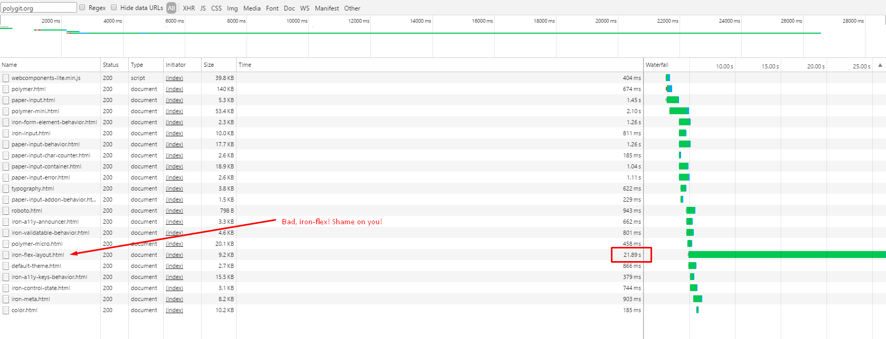

# i-dont-know-polymer


## Definitions

**Web components** is a collection of native browser features that the W3C is still working on:

🔹 Custom elements: Technology responsible for declaring our own elements just like native ones.

🔹 Templates: Responsible for declaring the element template.

🔹 Shadow DOM: Scoping our elements and not letting CSS and JS overflow out of it.

🔹 HTML imports: Importing element declarations from another file.


## BROWSER SUPPORT (The frontend nightmare 😱😱😱)


So, **Chrome** is the only browser giving almost full support to web components.

# Polymer

Polymer aims to solve this problem by providing virtual support for all these features in those browsers where it's not yet supported.

## Source code

The [Polymer source code](http://bit.ly/downloadpolymerjs) is split into three html files allowing the consumer to use three different sizes of the framework.

* micro-polymer
* mini-polymer (referencing micro-polymer)
* polymer (referencing mini-polymer)

It also comes with the web-components library that can also be loaded based on consumer preferences.


Fiddling (playground)
---------------------
In order to save time, the first Polymer exercises will be done on Plunkr. Later, they will be pushed to this repo.

#### 1. Importing Polymer (for practising purposes)

[Plunk](https://plnkr.co/edit/QylLhWU4FAqyDml574NW?p=preview)

* ```rel``` attribute is not supported for all browsers => We use webcomponentslite.mint.js that will work as a fallback shim and allow older browsers to use the rel attribute and load full html documents as well.

* ```<base>``` tag allows modifying the base directory the document will load the reference files from.

* We can (only for playing on plunkr or similar) get all polymer components from the following base: ```<base href="https://polygit.org/components">``` **Note:** It is slow as hell!

 


#### 2. Hello Element

[Plunk](https://plnkr.co/edit/gWkLtg39GTsJt2hUuq7Q?p=preview)

Creating an element is quite basic. You just have to instantiate a Polymer object, giving a value to the ```is``` property that will act as the component **id**.
Then, use that same id to define the template inside a ```<dom-module></dom-module>``` tag. You can see [the Plunker](https://plnkr.co/edit/gWkLtg39GTsJt2hUuq7Q?p=preview) if it still not clear.


#### 3. Including our Hello Element

[Plunk](https://plnkr.co/edit/fMYgGptFjf2Z4zx6Zkmt?p=preview)

Importing the element is done as a [normal import.](https://w3c.github.io/webcomponents/spec/imports/)
The ```HTMLImports.whenReady``` used before to instance the element inside the ```<script>``` tags is no longer necessary, as the element will be also an import.
=> If one dependency is already loaded, it won't load it again.
=> **unresolved** attribute hides the tag where it's been declared until all contained elements are loaded. (like the ng-cloak in AngularJS)
