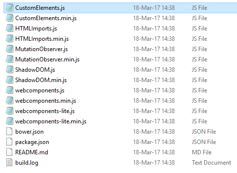
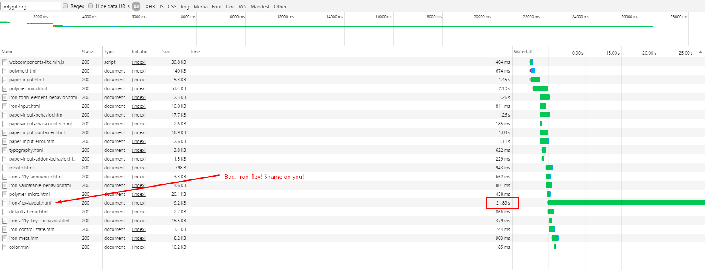
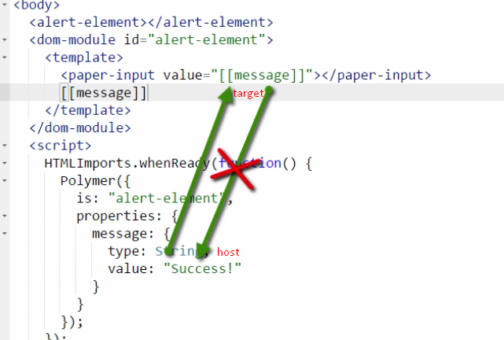
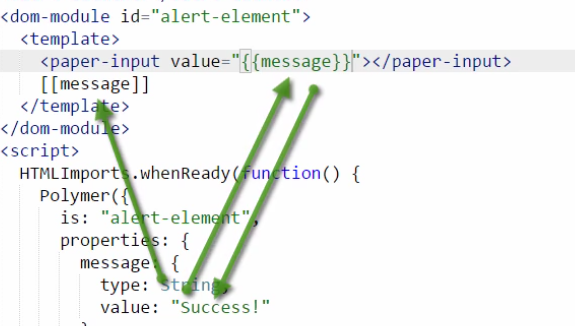
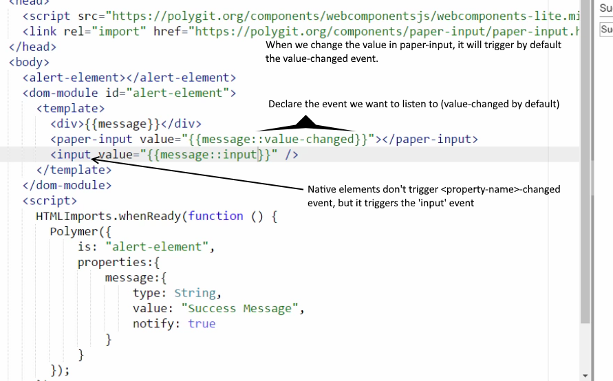

# i-dont-know-polymer


## Definitions

**Web components** is a collection of native browser features that the W3C is still working on:

🔹 Custom elements: Technology responsible for declaring our own elements just like native ones.

🔹 Templates: Responsible for declaring the element template.

🔹 Shadow DOM: Scoping our elements and not letting CSS and JS overflow out of it.

🔹 HTML imports: Importing element declarations from another file.


## BROWSER SUPPORT (The frontend nightmare 😱😱😱)


So, **Chrome** is the only browser giving almost full support to web components.

# Polymer

Polymer aims to solve this problem by providing virtual support for all these features in those browsers where it's not yet supported.

## Source code

The [Polymer source code](http://bit.ly/downloadpolymerjs) is split into three html files allowing the consumer to use three different sizes of the framework.

* micro-polymer
* mini-polymer (referencing micro-polymer)
* polymer (referencing mini-polymer)

It also comes with the web-components library that can also be loaded based on consumer preferences.



Fiddling (playground)
---------------------
In order to save time, the first Polymer exercises will be done on Plunkr. Later, they will be pushed to this repo.

#### 1. Importing Polymer (for practising purposes)

[Plunk](https://plnkr.co/edit/QylLhWU4FAqyDml574NW?p=preview)

* ```rel``` attribute is not supported for all browsers => We use webcomponentslite.mint.js that will work as a fallback shim and allow older browsers to use the rel attribute and load full html documents as well.

* ```<base>``` tag allows modifying the base directory the document will load the reference files from.

* We can (only for playing on plunkr or similar) get all polymer components from the following base: ```<base href="https://polygit.org/components">``` **Note:** It is slow as hell!

 


#### 2. Hello Element

[Plunk](https://plnkr.co/edit/gWkLtg39GTsJt2hUuq7Q?p=preview)

Creating an element is quite basic. You just have to instantiate a Polymer object, giving a value to the ```is``` property that will act as the component **id**.
Then, use that same id to define the template inside a ```<dom-module></dom-module>``` tag. You can see [the Plunker](https://plnkr.co/edit/gWkLtg39GTsJt2hUuq7Q?p=preview) if it still not clear.


#### 3. Including our Hello Element

[Plunk](https://plnkr.co/edit/fMYgGptFjf2Z4zx6Zkmt?p=preview)

Importing the element is done as a [normal import.](https://w3c.github.io/webcomponents/spec/imports/)
The ```HTMLImports.whenReady``` used before to instance the element inside the ```<script>``` tags is no longer necessary, as the element will be also an import.
=> If one dependency is already loaded, it won't load it again.
=> **unresolved** attribute hides the tag where it's been declared until all contained elements are loaded. (like the ng-cloak in AngularJS)

Including elements in a separate file is the best practice.

#### 4. Class-style Constructor
With the Polymer function a custom element is defined and registered in only one action. Then, the custom element has to be included in the page HTML. The dom-module was set only for us to add any content for an element.
There is a way where we can set up our custom element's prototype chain but not register it immediately: This is done through the Polymer class function.
```
helloElement = Polymer.Class({
    is: "hello-element",
    created: function() {
        this.textContent = "Hello there";
    }
 });
```
And then we register it as:
```
 document.registerElement('hello-element', HelloElement);
```

Lastly, a new element instance can be created through JavaScript and appended in the body without the need of defining the <hello-element> tag in the body.f

```
var el = new HelloElement();
document.querySelector("body").appendChild(el);
var el2 = document.createElement("hello-element");
document.querySelector("body").appendChild(el2);
```

#### 5. Life-cycle callbacks

[Plunk](https://plnkr.co/edit/ZVNreaVLcerR61S3qGSM?p=preview)

The callback names are very self-explanatory.

* created
* ready
* attached
* detached
* attributeChanged(attrName, oldVal, newVal)
* factoryImpl: **only** called then the element is instantiated using the 'new' key and the Polymer constructor:

```
Element = Polymer ({ is: element-name, factoryImpl ...});
var el = new Element(); // => factoryImpl will be called.

<element-name></element-name> // => factoryImpl will NOT be called.

var el2 = document.createElement("hello-element");
document.querySelector("body").appendChild(el2); // => factoryImpl will NOT be called.
```

#### 6. Extending from a native type

Native types can be extended with the property ```extends``` in the ```Polymer``` constructor definition.

MyExtendedInput = Polymer({
    is: 'my-extended-input',
    extends: 'input',
    ...
});

In order to use the extended element:

Option 1:
```
<input type="text" is="my-extended-input" />
```
Option 2:
```
var el1 = new MyExtendedInput();
document.querySelector("body").appendChild(el1);
```
Option 3:
```
var el2 = document.createElement("input", "my-extended-input");
document.querySelector("body").appendChild(el2);
```

========================

This is the moment I realized Polymer 2.0 is already out. Going to finish this course and go for some Polymer 2.0 under [i-dont-know-polymer-v2](i-dont-know-polymer-v2)

========================

#### 7. Property keys

In the Polymer constructor configuration, use the properties  polymer attribute.
This attribute contains the following keys:
```
properties: {
type:
value:
reflectToAttribute:
readOnly:
notify:
computed:
observer:
}
```

Example:

```
Polymer({
is: "alert-element",
properties: {
  message: {
        type: String,
        value: "Hello there"
        }
   },
   alertUpdateTime: {
     type: Date,
     value: function(){
        return new Date();
     }
   }
});
```
And use it as:
```
<dom-module id="alert-element">
<template>[[alertUpdateTime]]</template>
</dom-module>
```

#### 8. Data binding

[Plunk](https://plnkr.co/edit/Mnrz6IvrIZ1tlMpLqnAH?p=preview)

In Polymer, when we use square brackets, the value is bound from the host to the target but not from the target to the host:

Square brackets:



Curly brackets:



host ~ model

target ~ view

These type of bindings are controlled by the readOnly and notify properties.
With notify: true => ```<property-name>-changed``` => triggers when the property is changed.

A Polymer object can get attached to property-name>-changed by:
```this.addEventListener("<property-name>-changed", function(){...});```

When setting readOnly to true, the target value will never get updated when the host value is changed, even if its using curly brackets.


When the document is loaded, Polymer looks for data annotations (curly and square brackets) and creates the property effects object, so any time this property changes:
When the property changes, a dirty check will be performed with the __data__.property-name value.

If the value has changed, the effectProperty array will be looped through, updating all corresponding DOM items
additionally, if the notify:true, Polymer will trigger a property-changed event.


observer on properties will only get notified when using
this.set(object.property, newValue), just like with objects data bindings, since
there is not a setter defined for properties. We must set new values using one of these options:
```
this.objectName = { property: "propValue", ...};
this.notifyPath( "objectName.property", "propValue");
this.set("objectName.property", "propValue);
```
And this will never notify any listner, so remember to avoid: ```this.opjectName.property```

